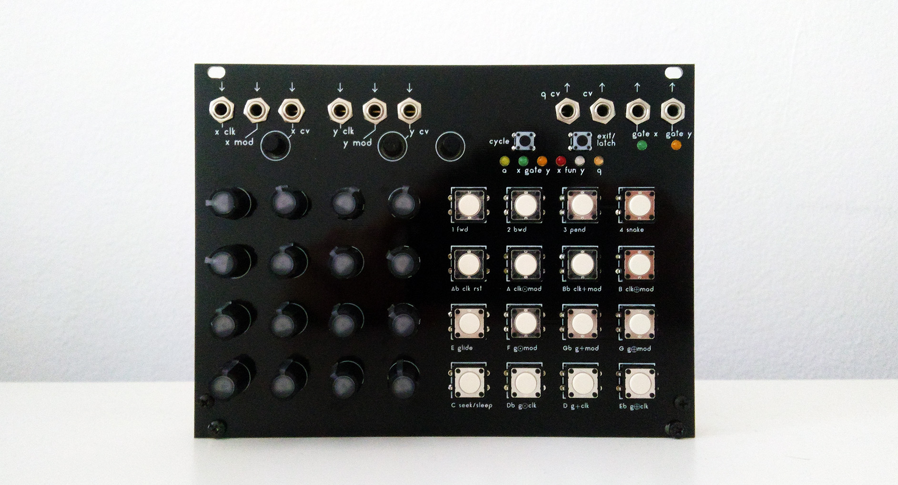

# Make Noise René Panel

Alternative panel for Make Noise René v1. It solves the issue of conductive input not always working due to grounding issues and replaces them with mechanical switches for a more reliable function.

Designed by Tomash GHz in collaboration with El Campesino.

## Features
* Tactile mechanical switches.
* Solves grounding issues.
* Improves panel font readability.

## Bill of Materials

## Instructions

